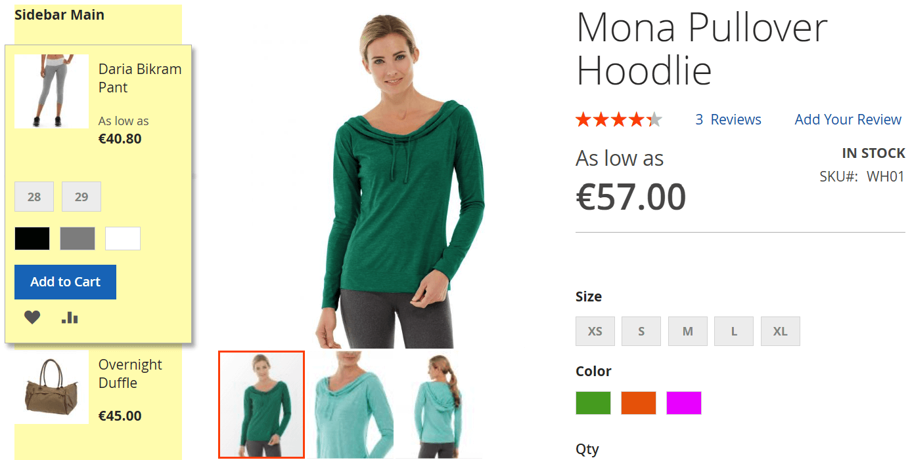
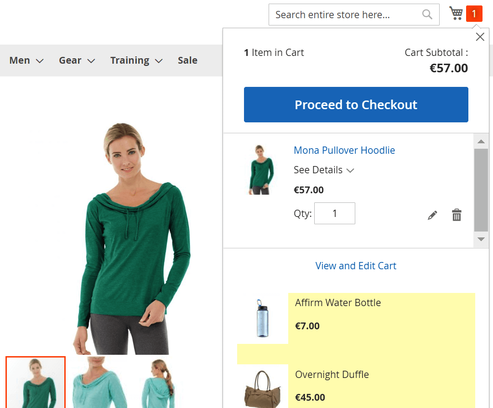
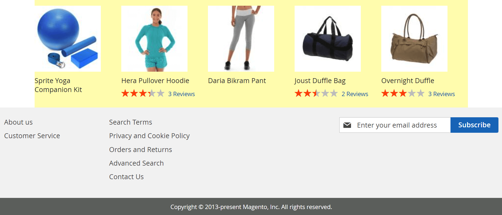
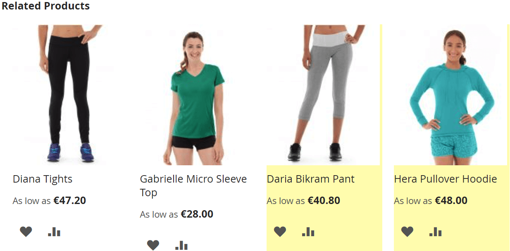
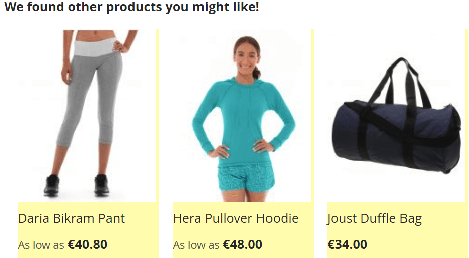
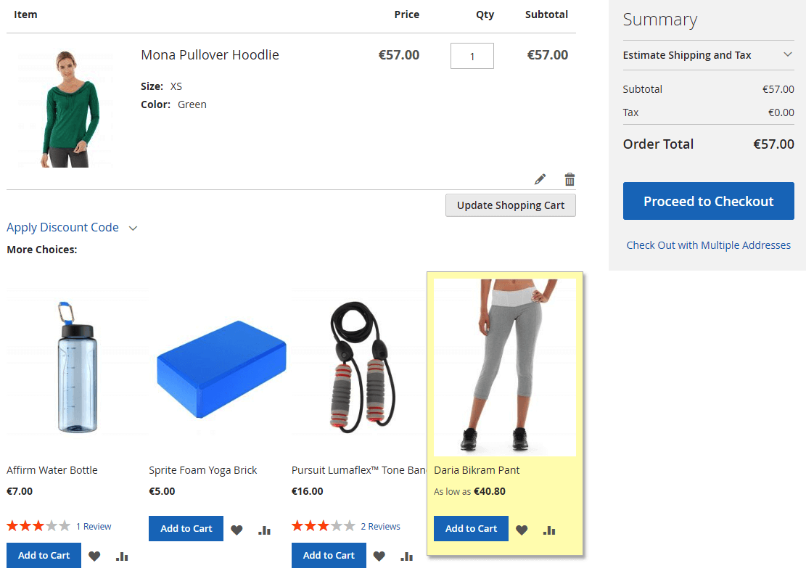

# Also Bought

[Leave review](https://commercemarketplace.adobe.com/vct-alsobought.html#bazaarvoice.reviews.tab) to help in further development

[](https://commercemarketplace.adobe.com/vct-alsobought.html)

- [Marketplace Page](https://commercemarketplace.adobe.com/vct-alsobought.html)
- [Release Notes](https://commercemarketplace.adobe.com/vct-alsobought.html#product.info.details.release_notes)
- [Quality Report](https://commercemarketplace.adobe.com/vct-alsobought.html#product.info.details.quality_report)

[//]: # (- [Reviews]&#40;https://commercemarketplace.adobe.com/vct-alsobought.html#bazaarvoice.reviews.tab&#41;)

## Overview

This [module](https://experienceleague.adobe.com/docs/commerce-operations/operational-playbook/glossary.html?lang=en#module) allows to add a block of products known as _"Frequently Bought Together"_ or _"Who Bought This Also Bought"_. These _Also Bought_ products can be further displayed using a custom [widget](https://experienceleague.adobe.com/docs/commerce-operations/operational-playbook/glossary.html?lang=en#widget) in a location of your choice or/and in [Related](https://experienceleague.adobe.com/docs/commerce-operations/operational-playbook/glossary.html?lang=en#related-product), [Up-Sell](https://experienceleague.adobe.com/docs/commerce-operations/operational-playbook/glossary.html?lang=en#upsell), [Cross-Sell](https://experienceleague.adobe.com/docs/commerce-operations/operational-playbook/glossary.html?lang=en#cross-sell) products.

This module will automatically create a list of products that were present in other customer orders, along with the currently viewed product. These products list is updated automatically according to the [cron schedule](https://docs.magento.com/user-guide/system/cron.html) you configure or manually in the [Admin](https://experienceleague.adobe.com/docs/commerce-operations/operational-playbook/glossary.html?lang=en#admin) or using CLI command.

### Tasks performed

- [x] Collect products that were present in other customer orders along with the product being viewed in a separate table using:
    - Cron (automatically according to schedule).
    - <kbd>Update Products</kbd> button in [Admin](https://experienceleague.adobe.com/docs/commerce-operations/operational-playbook/glossary.html?lang=en#admin-area).
    - CLI command.
- [x] Show _Also Bought_ products in:
    - custom <kbd>VCT Also Bought</kbd> [widget(s)](https://experienceleague.adobe.com/docs/commerce-operations/operational-playbook/glossary.html?lang=en#widget).
    - [Related](https://experienceleague.adobe.com/docs/commerce-operations/operational-playbook/glossary.html?lang=en#related-product), [Up-Sell](https://experienceleague.adobe.com/docs/commerce-operations/operational-playbook/glossary.html?lang=en#upsell), [Cross-Sell](https://experienceleague.adobe.com/docs/commerce-operations/operational-playbook/glossary.html?lang=en#cross-sell) products.
- [x] Show _Also Bought_ products in a widget(s) for:
    - Specific products manually selected.
    - [All product types](https://experienceleague.adobe.com/docs/commerce-operations/operational-playbook/glossary.html?lang=en#product-types), [Bundle](https://experienceleague.adobe.com/docs/commerce-operations/operational-playbook/glossary.html?lang=en#bundle-product), [Configurable](https://experienceleague.adobe.com/docs/commerce-operations/operational-playbook/glossary.html?lang=en#configurable-product), [Downloadable](https://experienceleague.adobe.com/docs/commerce-operations/operational-playbook/glossary.html?lang=en#downloadable-product), [Grouped](https://experienceleague.adobe.com/docs/commerce-operations/operational-playbook/glossary.html?lang=en#grouped-product), [Simple](https://experienceleague.adobe.com/docs/commerce-operations/operational-playbook/glossary.html?lang=en#simple-product), [Virtual](https://experienceleague.adobe.com/docs/commerce-operations/operational-playbook/glossary.html?lang=en#virtual-product) products.
- [x] Show or hide _Also Bought_ products in [Related](https://experienceleague.adobe.com/docs/commerce-operations/operational-playbook/glossary.html?lang=en#related-product), [Up-Sell](https://experienceleague.adobe.com/docs/commerce-operations/operational-playbook/glossary.html?lang=en#upsell), [Cross-Sell](https://experienceleague.adobe.com/docs/commerce-operations/operational-playbook/glossary.html?lang=en#cross-sell) products.
- [x] Show random _Also Bought_ products instead of last purchased products in a custom <kbd>VCT Also Bought</kbd> [widget](https://experienceleague.adobe.com/docs/commerce-operations/operational-playbook/glossary.html?lang=en#widget), [Related](https://experienceleague.adobe.com/docs/commerce-operations/operational-playbook/glossary.html?lang=en#related-product), [Up-Sell](https://experienceleague.adobe.com/docs/commerce-operations/operational-playbook/glossary.html?lang=en#upsell), [Cross-Sell](https://experienceleague.adobe.com/docs/commerce-operations/operational-playbook/glossary.html?lang=en#cross-sell) products.
- [x] Configure _Also Bought_ widget:
    - [x] Set title for widget(s).
    - [x] Show or hide the following product card elements in _Also Bought_ widget of your choice separately for each widget:
        - Product image, Price box.
        - Reviews summary (products rating and number of reviews).
        - <kbd>Add To Cart</kbd>, <kbd>Add To Wish List</kbd>, <kbd>Add To Compare</kbd> buttons.
        - Configurable products options in case of [<kbd>Visual Swatch</kbd>](https://experienceleague.adobe.com/docs/commerce-admin/catalog/product-attributes/swatches.html?lang=en) or [<kbd>Text Swatch</kbd>](https://experienceleague.adobe.com/docs/commerce-admin/catalog/product-attributes/swatches.html?lang=en).
    - [x] Set _Also Bought_ widget location of your choice from the following containers:
        - <kbd>After Page Header</kbd>, <kbd>After Page Header Top</kbd>, <kbd>Alert Urls</kbd>.
        - <kbd>Before Main Columns</kbd>, <kbd>Main Content Top</kbd>, <kbd>Main Content Container</kbd>, <kbd>Main Content Area</kbd>, <kbd>Main Content Aside</kbd>, <kbd>Main Content Bottom</kbd>.
        - <kbd>Mini-Cart Promotion Block</kbd>.
        - <kbd>Page Header</kbd>, <kbd>Page Header Container</kbd>, <kbd>Page Header Panel</kbd>, <kbd>Page Top</kbd>, <kbd>Page Bottom</kbd>.
        - <kbd>Product Auxiliary Info</kbd>, <kbd>Product Info Auxiliary Container</kbd>, <kbd>Product Social Links Container</kbd>, <kbd>Product View Extra Hint</kbd>, <kbd>Review Form Fields Before</kbd>.
        - <kbd>Sidebar Main</kbd>, <kbd>Sidebar Additional</kbd>, <kbd>Compare Link Wrapper</kbd>.
        - <kbd>Before Page Footer</kbd>, <kbd>Page Footer</kbd>, <kbd>Before Page Footer Container</kbd>, <kbd>Page Footer Container</kbd>, <kbd>CMS Footer Links</kbd>.

### Features

- [x] Wide customization of the _Also Bought_ product block by implementing it with a [widget](https://experienceleague.adobe.com/docs/commerce-operations/operational-playbook/glossary.html?lang=en#widget).
- [x] Tested and verified by [Adobe Extension Quality Program](https://developer.adobe.com/commerce/marketplace/guides/sellers/extension-quality-program).
- [x] Meets [Magento Coding Standard](https://developer.adobe.com/commerce/php/coding-standards).
- [x] [Plugins (Interceptors)](https://developer.adobe.com/commerce/php/development/components/plugins) are used to prevent conflicts among [modules](https://experienceleague.adobe.com/docs/commerce-operations/operational-playbook/glossary.html?lang=en#module).

## Installation

Use [Composer](https://getcomposer.org/doc/00-intro.md) to install the module or download the code for review:

- [Log in](https://account.magento.com/customer/account/login) to your Marketplace account that purchased this module.
- Add your [<kbd>Access Keys</kbd>](https://commercemarketplace.adobe.com/customer/accessKeys) for [Adobe Commerce Marketplace](https://commercemarketplace.adobe.com) [repository](https://getcomposer.org/doc/05-repositories.md#repository) using the following command:

```bash
composer config http-basic.repo.magento.com <Public Key> <Private Key>
```

where `<Public Key>` and `<Private Key>` are your [<kbd>Access Keys</kbd>](https://commercemarketplace.adobe.com/customer/accessKeys).

For example:

```bash
composer config http-basic.repo.magento.com 39b747b8ab1d624582bb3n1a09deb489 31b9fce4cb78f523fd34aa3abb90c89c
```

- Run the following commands:

```bash
composer require vct/alsobought # Install module with Composer
bin/magento setup:upgrade # Update the database schema and data

bin/magento setup:static-content:deploy --force # Deploy static view files
bin/magento setup:di:compile # Compile the code
```

[Get your authentication keys](https://experienceleague.adobe.com/docs/commerce-operations/installation-guide/prerequisites/authentication-keys.html?lang=en) and [install an extension](https://experienceleague.adobe.com/docs/commerce-operations/installation-guide/tutorials/extensions.html?lang=en) in the Magento documentation.

:::tip[TIP]
Help for common issues is on the [FAQ page](/faq#installation-and-update). For further assistance, please contact me by email [vct.vendor@gmail.com](mailto:vct.vendor@gmail.com?subject=Installation%20issue&body=To%20help%20you%20faster%2C%20please%20provide%20me%20with%20the%20following%20information%3A%0A%0AMagento%20version%20and%20edition%3A%20(e.g.%20Adobe%20Commerce%202.4.6-p6)%0APHP%20version%3A%20(e.g.%20PHP%208.2.8)%0AComposer%20version%3A%20(e.g.%202.2.21)).
:::

## Configuration

:::danger[IMPORTANT]
<kbd>Flush Magento Cache</kbd> in <kbd>SYSTEM</kbd> <kbd>Tools</kbd> <kbd>Cache Management</kbd> after configuration change to see the changes!
:::

[Clean and flush cache types](https://experienceleague.adobe.com/docs/commerce-operations/configuration-guide/cli/manage-cache.html?lang=en#clean-and-flush-cache-types) in the Magento documentation.

## Create <kbd>VCT Also Bought</kbd> widget(s)

Use a custom <kbd>VCT Also Bought</kbd> widget to display _Also Bought_ products: <kbd>Content</kbd> <kbd>ELEMENTS</kbd> <kbd>Widgets</kbd> <kbd>Add Widget</kbd> <kbd>WIDGET</kbd> <kbd>SETTINGS</kbd> <kbd>Type</kbd> <kbd>VCT Also Bought</kbd>.

:::tip[TIP]
Widget configs can be set separately for each widget.
:::

[Creating and managing widgets](https://docs.magento.com/user-guide/cms/widget-create.html) in the Magento documentation.

<kbd>Content</kbd> <kbd>ELEMENTS</kbd> <kbd>Widgets</kbd> <kbd>[VCT Also Bought]</kbd> <kbd>WIDGET</kbd> <kbd>Widget Options</kbd>:

| Config                           | Type                             | Default         | Description                                                                                  |
|----------------------------------|----------------------------------|-----------------|----------------------------------------------------------------------------------------------|
| <kbd>Widget Block Title</kbd>    | <kbd>string</kbd>                | <kbd>none</kbd> | Widget block title in the frontend.                                                          |
| <kbd>Random Products</kbd>       | <kbd>Yes</kbd><br/><kbd>No</kbd> | <kbd>No</kbd>   | <kbd>Yes</kbd> to display random and <kbd>No</kbd> to display newest _Also Bought_ products. |
| <kbd>Products Number</kbd>       | <kbd>int</kbd>                   | <kbd>5</kbd>    | Number of displayed _Also Bought_ products.                                                  |
| <kbd>Number Of Columns</kbd>     | <kbd>int</kbd>                   | <kbd>5</kbd>    | Number of columns display in _Also Bought_ widget.                                           |
| <kbd>Show Product Image</kbd>    | <kbd>Yes</kbd><br/><kbd>No</kbd> | <kbd>Yes</kbd>  | Show or hide product image(s).                                                               |
| <kbd>Show Reviews Summary</kbd>  | <kbd>Yes</kbd><br/><kbd>No</kbd> | <kbd>Yes</kbd>  | Show or hide product rating and number of reviews.                                           |
| <kbd>Show Price</kbd>            | <kbd>Yes</kbd><br/><kbd>No</kbd> | <kbd>Yes</kbd>  | Show or hide product price.                                                                  |
| <kbd>Show Swatches</kbd>         | <kbd>Yes</kbd><br/><kbd>No</kbd> | <kbd>No</kbd>   | Show or hide swatches (configurable products options).                                       |
| <kbd>Show Add To Cart</kbd>      | <kbd>Yes</kbd><br/><kbd>No</kbd> | <kbd>Yes</kbd>  | Show or hide <kbd>Add To Cart</kbd> button.                                                  |
| <kbd>Show Add To Wish List</kbd> | <kbd>Yes</kbd><br/><kbd>No</kbd> | <kbd>Yes</kbd>  | Show or hide <kbd>Add To Wish List</kbd> button.                                             |
| <kbd>Show Add To Compare</kbd>   | <kbd>Yes</kbd><br/><kbd>No</kbd> | <kbd>Yes</kbd>  | Show or hide <kbd>Add To Compare</kbd> button.                                               |

:::tip[TIP]
To display products in a single row, set the <kbd>Number Of Columns</kbd> to a value equal to or greater than the <kbd>Products Number</kbd>.
:::

### <kbd>Update Products</kbd> in widget

:::danger[IMPORTANT]
Changes in _Also Bought_ product list will be visible in the frontend only after updating the products using:

- cron (scheduled tasks) in <kbd>Stores</kbd> <kbd>SETTINGS</kbd> <kbd>Configuration</kbd> <kbd>ADVANCED</kbd> <kbd>System</kbd> <kbd>Cron (Scheduled Tasks)</kbd> <kbd>Cron configuration options for group: vct_alsobought</kbd>.
- <kbd>Update Products</kbd> button in Admin in <kbd>Stores</kbd> <kbd>SETTINGS</kbd> <kbd>Configuration</kbd> <kbd>VCT</kbd> <kbd>Also Bought</kbd> <kbd>Update</kbd>.
- `bin/magento vct:alsobought:update` command.

:::

#### Configure <kbd>vct_alsobought</kbd> cron group

Configure <kbd>Cron configuration options for group: vct_alsobought</kbd> in <kbd>Stores</kbd> <kbd>SETTINGS</kbd> <kbd>Configuration</kbd> <kbd>ADVANCED</kbd> <kbd>System</kbd> <kbd>Cron (Scheduled Tasks)</kbd> to set a schedule for _Also Bought_ products updates.

:::info[INFO]
By default, _Also Bought_ products are updated with cron **every 60 minutes**.
:::

[Cron (scheduled tasks)](https://experienceleague.adobe.com/docs/commerce-admin/systems/tools/cron.html?lang=en#configure-cron) in the Magento documentation.

### Configure Related products

<kbd>Stores</kbd> <kbd>SETTINGS</kbd> <kbd>Configuration</kbd> <kbd>VCT</kbd> <kbd>Also Bought</kbd>:

| Config                                | Type                                   | Default          | Description                                                                                                                                                  |
|---------------------------------------|----------------------------------------|------------------|--------------------------------------------------------------------------------------------------------------------------------------------------------------|
| <kbd>Show By Related</kbd>            | <kbd>Yes</kbd><br/><kbd>No</kbd>       | <kbd>Yes</kbd>   | <kbd>Yes</kbd> to add _Also Bought_ products to Related products.<br/><kbd>No</kbd> to remove previously added _Also Bought_ products from Related products. |
| <kbd>Random In Related</kbd>          | <kbd>Yes</kbd><br/><kbd>No</kbd>       | <kbd>No</kbd>    | <kbd>Yes</kbd> to display random _Also Bought_ products in Related products.<br/><kbd>No</kbd> to display newest _Also Bought_ products in Related products. |
| <kbd>Position In Related</kbd>        | <kbd>Before</kbd><br/><kbd>After</kbd> | <kbd>After</kbd> | Show _Also Bought_ products <kbd>Before</kbd> or <kbd>After</kbd> Related products.                                                                          |
| <kbd>Products Number In Related</kbd> | <kbd>int</kbd>                         | <kbd>2</kbd>     | Number of _Also Bought_ products in Related products.                                                                                                        |

### Configure Up-Sell products

<kbd>Stores</kbd> <kbd>SETTINGS</kbd> <kbd>Configuration</kbd> <kbd>VCT</kbd> <kbd>Also Bought</kbd>:

| Config                                | Type                                   | Default          | Description                                                                                                                                                  |
|---------------------------------------|----------------------------------------|------------------|--------------------------------------------------------------------------------------------------------------------------------------------------------------|
| <kbd>Show By Up-Sell</kbd>            | <kbd>Yes</kbd><br/><kbd>No</kbd>       | <kbd>Yes</kbd>   | <kbd>Yes</kbd> to add _Also Bought_ products to Up-Sell products.<br/><kbd>No</kbd> to remove previously added _Also Bought_ products from Up-Sell products. |
| <kbd>Random In Up-Sell</kbd>          | <kbd>Yes</kbd><br/><kbd>No</kbd>       | <kbd>No</kbd>    | <kbd>Yes</kbd> to display random _Also Bought_ products in Up-Sell products.<br/><kbd>No</kbd> to display newest _Also Bought_ products in Up-Sell products. |
| <kbd>Position In Up-Sell</kbd>        | <kbd>Before</kbd><br/><kbd>After</kbd> | <kbd>After</kbd> | Show _Also Bought_ products <kbd>Before</kbd> or <kbd>After</kbd> Up-Sell products.                                                                          |
| <kbd>Products Number In Up-Sell</kbd> | <kbd>int</kbd>                         | <kbd>2</kbd>     | Number of _Also Bought_ products in Up-Sell products.                                                                                                        |

### Configure Cross-Sell products

<kbd>Stores</kbd> <kbd>SETTINGS</kbd> <kbd>Configuration</kbd> <kbd>VCT</kbd> <kbd>Also Bought</kbd>:

| Config                                   | Type                                   | Default          | Description                                                                                                                                                        |
|------------------------------------------|----------------------------------------|------------------|--------------------------------------------------------------------------------------------------------------------------------------------------------------------|
| <kbd>Show By Cross-Sell</kbd>            | <kbd>Yes</kbd><br/><kbd>No</kbd>       | <kbd>Yes</kbd>   | <kbd>Yes</kbd> to add _Also Bought_ products to Cross-Sell products.<br/><kbd>No</kbd> to remove previously added _Also Bought_ products from Cross-Sell products. |
| <kbd>Random In Cross-Sell</kbd>          | <kbd>Yes</kbd><br/><kbd>No</kbd>       | <kbd>No</kbd>    | <kbd>Yes</kbd> to display random _Also Bought_ products in Cross-Sell products.<br/><kbd>No</kbd> to display newest _Also Bought_ products in Cross-Sell products. |
| <kbd>Position In Cross-Sell</kbd>        | <kbd>Before</kbd><br/><kbd>After</kbd> | <kbd>After</kbd> | Show _Also Bought_ products <kbd>Before</kbd> or <kbd>After</kbd> Cross-Sell products.                                                                             |
| <kbd>Products Number In Cross-Sell</kbd> | <kbd>int</kbd>                         | <kbd>2</kbd>     | Number of _Also Bought_ products in Cross-Sell products.                                                                                                           |

## Known issue

:::warning[ISSUE]
<kbd>Add To Cart</kbd> button in products card can cause a JavaScript error in containers containing a <code>form</code> tag e.g. <kbd>Review Form Fields Before</kbd> container.

This is happening because the button itself already contains a <code>form</code> tag.
:::

:::tip[FIX]
Set <kbd>Content</kbd> <kbd>ELEMENTS</kbd> <kbd>Widgets</kbd> <kbd>[VCT Also Bought]</kbd> <kbd>WIDGET</kbd> <kbd>Widget Options</kbd> <kbd>Show Add To Cart</kbd> to <kbd>No</kbd> to disable <kbd>Add To Cart</kbd> button in containers with a <code>form</code> tag.
:::

## Examples

Only some examples are demonstrated here.

### <kbd>Sidebar Main</kbd> container



### <kbd>Mini-cart Promotion</kbd> container



### <kbd>Before Page Footer</kbd> container



### Related products block



### Up-Sell products block



### Cross-Sell products block


