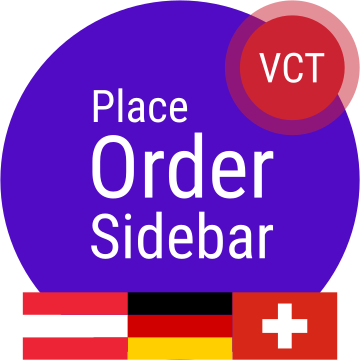
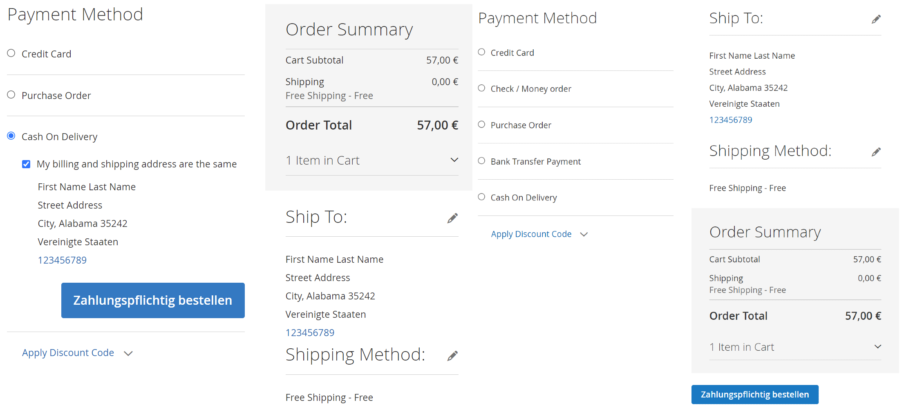
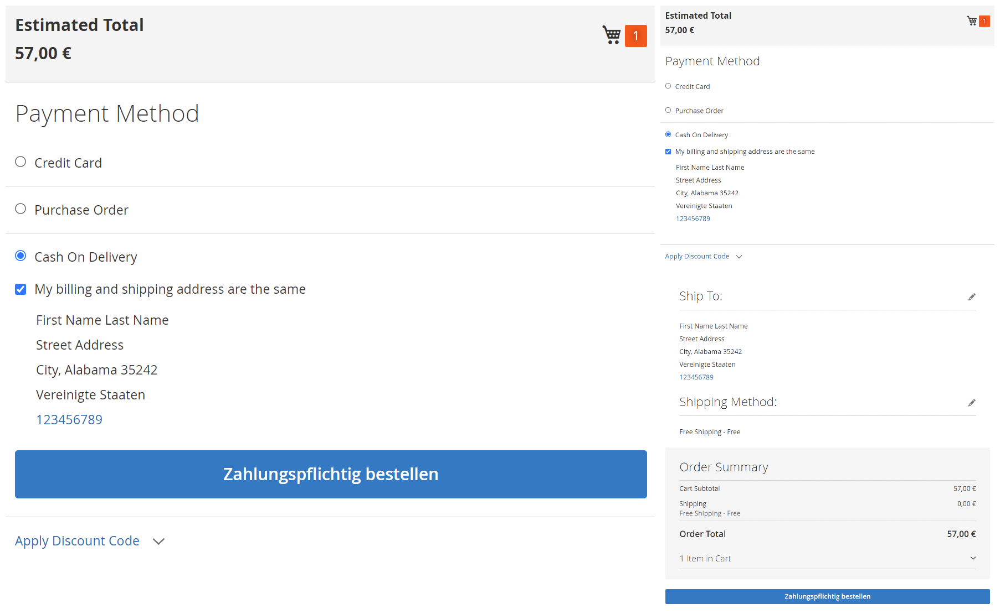

# Place Order Sidebar

[Leave review](https://commercemarketplace.adobe.com/vct-placeordersidebar.html#bazaarvoice.reviews.tab) to help in further development

[](https://commercemarketplace.adobe.com/vct-placeordersidebar.html)

- [Marketplace Page](https://commercemarketplace.adobe.com/vct-placeordersidebar.html)
- [Release Notes](https://commercemarketplace.adobe.com/vct-placeordersidebar.html#product.info.details.release_notes)
- [Quality Report](https://commercemarketplace.adobe.com/vct-placeordersidebar.html#product.info.details.quality_report)

[//]: # (- [Reviews]&#40;https://commercemarketplace.adobe.com/vct-placeordersidebar.html#bazaarvoice.reviews.tab&#41;)

## Overview

If your shop is represented in the markets of D-A-CH region (Austria, Germany, Switzerland) this module may be interesting for you.

> (1) On the websites used for electronic commerce with consumers, the trader is to indicate clearly and unequivocally at the latest at the beginning of the ordering process..., whether any delivery restrictions apply and which means of payment are accepted.
>
> (2) In the case of a consumer contract concluded in electronic commerce that has as its subject-matter a for-a-fee service provided by the trader, the trader must provide to the consumer the information..., and must do so in a clear and comprehensible manner, displaying it prominently, immediately before the consumer places the order.
>
> (3) In case of a contract in accordance with subsection (2), the trader is to arrange the ordering situation such that the consumer explicitly confirms by their order that they enter into obligation to effect a payment. If the order is placed using a button, the obligation of the trader under sentence 1 is deemed to have been met only if this button is marked in an easy-to-read manner with nothing but the words "Order and Pay", or with equally unambiguous wording.
>
> – [German Civil Code (BGB) Section 312j Special obligations vis-à-vis consumers in electronic commerce](https://www.gesetze-im-internet.de/englisch_bgb/englisch_bgb.html#p1168)

Original:

> (1) Auf Webseiten für den elektronischen Geschäftsverkehr mit Verbrauchern hat der Unternehmer zusätzlich zu den Angaben nach § 312i Absatz 1 spätestens bei Beginn des Bestellvorgangs klar und deutlich anzugeben, ob Lieferbeschränkungen bestehen und welche Zahlungsmittel akzeptiert werden.
>
> (2) Bei einem Verbrauchervertrag im elektronischen Geschäftsverkehr, der den Verbraucher zur Zahlung verpflichtet, muss der Unternehmer dem Verbraucher die Informationen gemäß Artikel 246a § 1 Absatz 1 Satz 1 Nummer 1, 5 bis 7, 8, 14 und 15 des Einführungsgesetzes zum Bürgerlichen Gesetzbuche, unmittelbar bevor der Verbraucher seine Bestellung abgibt, klar und verständlich in hervorgehobener Weise zur Verfügung stellen.
>
> (3) Der Unternehmer hat die Bestellsituation bei einem Vertrag nach Absatz 2 so zu gestalten, dass der Verbraucher mit seiner Bestellung ausdrücklich bestätigt, dass er sich zu einer Zahlung verpflichtet. Erfolgt die Bestellung über eine Schaltfläche, ist die Pflicht des Unternehmers aus Satz 1 nur erfüllt, wenn diese Schaltfläche gut lesbar mit nichts anderem als den Wörtern "zahlungspflichtig bestellen" oder mit einer entsprechenden eindeutigen Formulierung beschriftet ist.
>
> – [Bürgerliches Gesetzbuch (BGB) § 312j Besondere Pflichten im elektronischen Geschäftsverkehr gegenüber Verbrauchern](https://www.gesetze-im-internet.de/bgb/__312j.html)

### Tasks performed

- [x] Move an <kbd>Order Summary</kbd> block at the end of the checkout sidebar.
- [x] Move the <kbd>Place Order</kbd> button after the <kbd>Order Summary</kbd> block.
- [x] Show the [checkout](https://experienceleague.adobe.com/docs/commerce-operations/operational-playbook/glossary.html?lang=en#checkout) sidebar with <kbd>Order Summary</kbd> in mobile view, which is not displayed in the default [Luma theme](https://developer.adobe.com/commerce/frontend-core/guide/css/quickstart/#why-do-you-need-to-create-a-custom-theme).
- [x] Translate <kbd>Place Order</kbd> button label as <kbd>Zahlungspflichtig bestellen</kbd> for stores of D-A-CH region (Austria, Germany, Switzerland).

### Features

- [x] Tested and verified by [Adobe Extension Quality Program](https://developer.adobe.com/commerce/marketplace/guides/sellers/extension-quality-program).
- [x] Meets [Magento Coding Standard](https://developer.adobe.com/commerce/php/coding-standards).

## Installation

Use [Composer](https://getcomposer.org/doc/00-intro.md) to install the module or download the code for review:

- [Log in](https://account.magento.com/customer/account/login) to your Marketplace account that purchased this module.
- Add your [<kbd>Access Keys</kbd>](https://commercemarketplace.adobe.com/customer/accessKeys) for [Adobe Commerce Marketplace](https://commercemarketplace.adobe.com) [repository](https://getcomposer.org/doc/05-repositories.md#repository) using the following command:

```bash
composer config http-basic.repo.magento.com <Public Key> <Private Key>
```

where `<Public Key>` and `<Private Key>` are your [<kbd>Access Keys</kbd>](https://commercemarketplace.adobe.com/customer/accessKeys).

For example:

```bash
composer config http-basic.repo.magento.com 39b747b8ab1d624582bb3n1a09deb489 31b9fce4cb78f523fd34aa3abb90c89c
```

- Run the following commands:

```bash
composer require vct/placeordersidebar # Install module with Composer
bin/magento setup:upgrade # Update the database schema and data

bin/magento setup:static-content:deploy --force # Deploy static view files
bin/magento setup:di:compile # Compile the code
```

[Get your authentication keys](https://experienceleague.adobe.com/docs/commerce-operations/installation-guide/prerequisites/authentication-keys.html?lang=en) and [install an extension](https://experienceleague.adobe.com/docs/commerce-operations/installation-guide/tutorials/extensions.html?lang=en) in the Magento documentation.

:::tip[TIP]
Help for common issues is on the [FAQ page](/faq#installation-and-update). For further assistance, please contact me by email [vct.vendor@gmail.com](mailto:vct.vendor@gmail.com?subject=Installation%20issue&body=To%20help%20you%20faster%2C%20please%20provide%20me%20with%20the%20following%20information%3A%0A%0AMagento%20version%20and%20edition%3A%20(e.g.%20Adobe%20Commerce%202.4.6-p6)%0APHP%20version%3A%20(e.g.%20PHP%208.2.8)%0AComposer%20version%3A%20(e.g.%202.2.21)).
:::

## Configuration

:::danger[IMPORTANT]
<kbd>Flush Magento Cache</kbd> in <kbd>SYSTEM</kbd> <kbd>Tools</kbd> <kbd>Cache Management</kbd> after configuration change to see the changes!
:::

[Clean and flush cache types](https://experienceleague.adobe.com/docs/commerce-operations/configuration-guide/cli/manage-cache.html?lang=en#clean-and-flush-cache-types) in the Magento documentation.

### <kbd>Enable</kbd> module

<kbd>Stores</kbd> <kbd>SETTINGS</kbd> <kbd>Configuration</kbd> <kbd>VCT</kbd> <kbd>Place Order Sidebar</kbd> <kbd>Config</kbd>:

| Config            | Type                             | Default       | Description                                                                                                                                                                                                                                                                                                                                                                                                                                            |
|-------------------|----------------------------------|---------------|--------------------------------------------------------------------------------------------------------------------------------------------------------------------------------------------------------------------------------------------------------------------------------------------------------------------------------------------------------------------------------------------------------------------------------------------------------|
| <kbd>Enable</kbd> | <kbd>Yes</kbd><br/><kbd>No</kbd> | <kbd>No</kbd> | <kbd>Yes</kbd> to:<ul><li>move an <kbd>Order Summary</kbd> block at the end of a checkout sidebar;</li><li>move a <kbd>Place Order</kbd> button after a <kbd>Order Summary</kbd> block;</li><li>display a checkout sidebar in mobile view;</li><li>translate <kbd>Place Order</kbd> button label as <kbd>Zahlungspflichtig bestellen</kbd> for stores in Austria, Germany, Switzerland.</li></ul><kbd>No</kbd> to make no changes or undo all changes. |

## Examples

### Desktop view before and after



### Mobile view before and after


