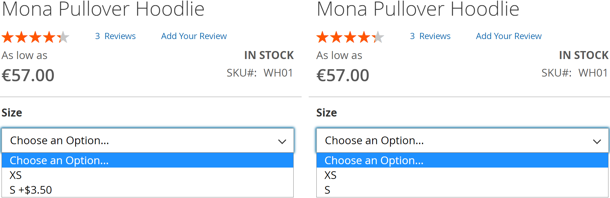

# Price Diff

[Leave review](https://commercemarketplace.adobe.com/vct-pricediff.html#bazaarvoice.reviews.tab) to help in further development

[](https://commercemarketplace.adobe.com/vct-pricediff.html)

- [Marketplace Page](https://commercemarketplace.adobe.com/vct-pricediff.html)
- [Release Notes](https://commercemarketplace.adobe.com/vct-pricediff.html#product.info.details.release_notes)
- [Quality Report](https://commercemarketplace.adobe.com/vct-pricediff.html#product.info.details.quality_report)

[//]: # (- [Reviews]&#40;https://commercemarketplace.adobe.com/vct-pricediff.html#bazaarvoice.reviews.tab&#41;)

## Overview

A [configurable product](https://experienceleague.adobe.com/docs/commerce-operations/operational-playbook/glossary.html?lang=en#configurable-product) appears to be a single product with lists of options for each variant. However, each option represents a separate product. The price displayed on the configurable product page is the lowest price among all variants. When you click on the dropdown, it displays the additional cost of the variant. This can negatively affect sales, which will not happen if the customer is informed of the price difference in a timely manner.

Hiding price difference from the dropdown of the configurable product:

- [x] Increase conversion: an unexpected price difference can lead to abandoned purchases. Hiding price difference encourages customers to focus on other product attributes that may be more appealing.
- [x] Increase higher-priced variant sales: with no price comparison, customers might be more inclined to choose the more expensive option that appeals to them more.
- [x] Simplify decision-making: hiding price differences streamlines the decision-making process for customers, minimizing purchase deliberation and decision fatigue.

### Features

- [x] Tested and verified by [Adobe Extension Quality Program](https://developer.adobe.com/commerce/marketplace/guides/sellers/extension-quality-program).
- [x] Meets [Magento Coding Standard](https://developer.adobe.com/commerce/php/coding-standards).
- [x] [Plugins (Interceptors)](https://developer.adobe.com/commerce/php/development/components/plugins) are used to prevent conflicts among [modules](https://experienceleague.adobe.com/docs/commerce-operations/operational-playbook/glossary.html?lang=en#module).

## Installation

Use [Composer](https://getcomposer.org/doc/00-intro.md) to install the module or download the code for review:

- [Log in](https://account.magento.com/customer/account/login) to your Marketplace account that purchased this module.
- Add your [<kbd>Access Keys</kbd>](https://commercemarketplace.adobe.com/customer/accessKeys) for [Adobe Commerce Marketplace](https://commercemarketplace.adobe.com) [repository](https://getcomposer.org/doc/05-repositories.md#repository) using the following command:

```bash
composer config http-basic.repo.magento.com <Public Key> <Private Key>
```

where `<Public Key>` and `<Private Key>` are your [<kbd>Access Keys</kbd>](https://commercemarketplace.adobe.com/customer/accessKeys).

For example:

```bash
composer config http-basic.repo.magento.com 39b747b8ab1d624582bb3n1a09deb489 31b9fce4cb78f523fd34aa3abb90c89c
```

- Run the following commands:

```bash
composer require vct/pricediff # Install module with Composer
bin/magento setup:upgrade # Update the database schema and data

bin/magento setup:static-content:deploy --force # Deploy static view files
bin/magento setup:di:compile # Compile the code
```

[Get your authentication keys](https://experienceleague.adobe.com/docs/commerce-operations/installation-guide/prerequisites/authentication-keys.html?lang=en) and [install an extension](https://experienceleague.adobe.com/docs/commerce-operations/installation-guide/tutorials/extensions.html?lang=en) in the Magento documentation.

:::tip[TIP]
Help for common issues is on the [FAQ page](/faq#installation-and-update). For further assistance, please contact me by email [vct.vendor@gmail.com](mailto:vct.vendor@gmail.com?subject=Installation%20issue&body=To%20help%20you%20faster%2C%20please%20provide%20me%20with%20the%20following%20information%3A%0A%0AMagento%20version%20and%20edition%3A%20(e.g.%20Adobe%20Commerce%202.4.6-p6)%0APHP%20version%3A%20(e.g.%20PHP%208.2.8)%0AComposer%20version%3A%20(e.g.%202.2.21)).
:::

## Configuration

:::danger[IMPORTANT]
<kbd>Flush Magento Cache</kbd> in <kbd>SYSTEM</kbd> <kbd>Tools</kbd> <kbd>Cache Management</kbd> after configuration change to see the changes!
:::

[Clean and flush cache types](https://experienceleague.adobe.com/docs/commerce-operations/configuration-guide/cli/manage-cache.html?lang=en#clean-and-flush-cache-types) in the Magento documentation.

### <kbd>Hide</kbd> price difference

<kbd>Stores</kbd> <kbd>SETTINGS</kbd> <kbd>Configuration</kbd> <kbd>VCT</kbd> <kbd>Price Diff</kbd> <kbd>Config</kbd>:

| Config          | Type                             | Default       | Description                                                                  |
|-----------------|----------------------------------|---------------|------------------------------------------------------------------------------|
| <kbd>Hide</kbd> | <kbd>Yes</kbd><br/><kbd>No</kbd> | <kbd>No</kbd> | Hide or display price difference in a configurable product options dropdown. |

## Example


