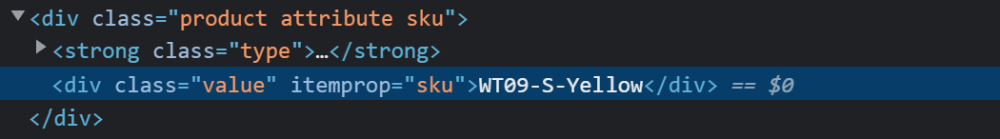
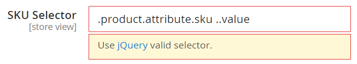
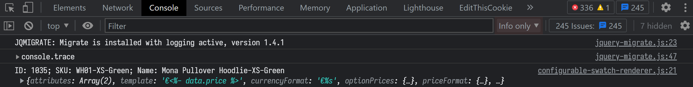
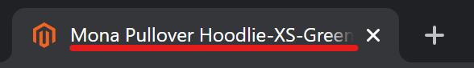
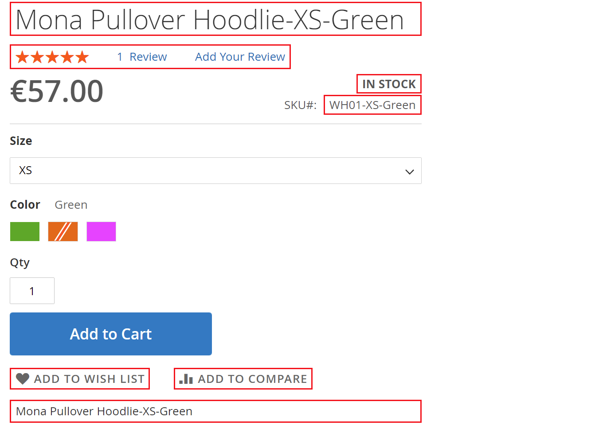
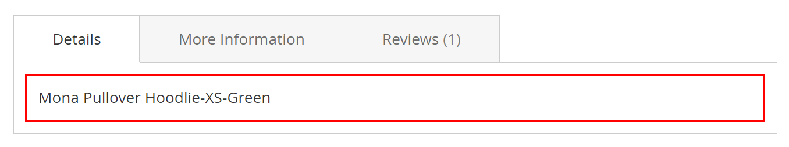
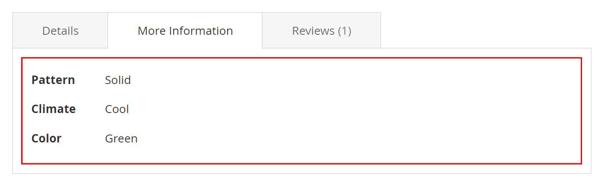
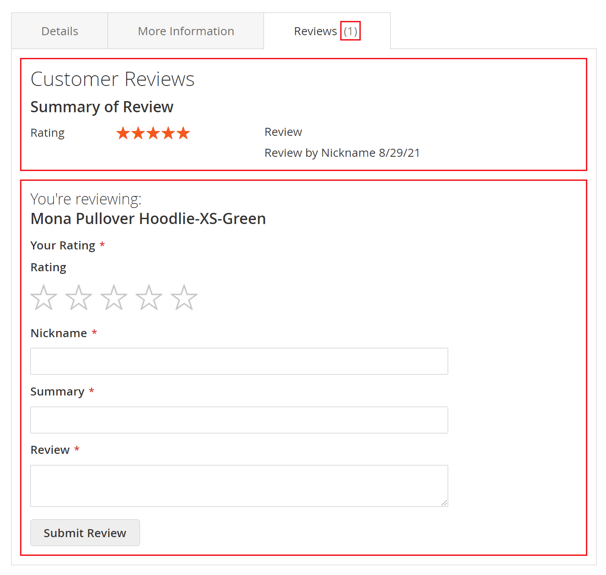
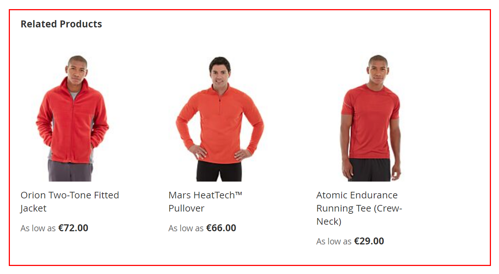
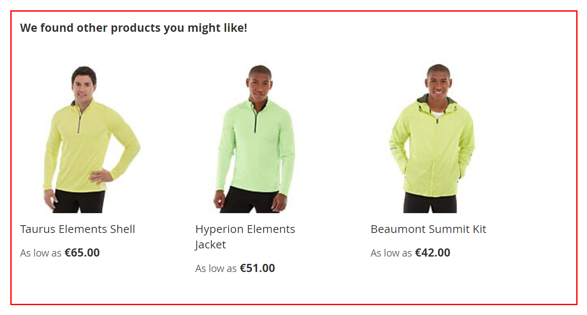

# Product Info Switcher

[Leave review](https://commercemarketplace.adobe.com/vct-productinfoswitcher.html#bazaarvoice.reviews.tab) to help in further development

[](https://commercemarketplace.adobe.com/vct-productinfoswitcher.html)

- [Marketplace Page](https://commercemarketplace.adobe.com/vct-productinfoswitcher.html)
- [Release Notes](https://commercemarketplace.adobe.com/vct-productinfoswitcher.html#product.info.details.release_notes)
- [Quality Report](https://commercemarketplace.adobe.com/vct-productinfoswitcher.html#product.info.details.quality_report)
- [Reviews](https://commercemarketplace.adobe.com/vct-productinfoswitcher.html#bazaarvoice.reviews.tab)

## Overview

A [configurable product](https://experienceleague.adobe.com/docs/commerce-operations/operational-playbook/glossary.html?lang=en#configurable-product) appears to be a single product with lists of options for each variant. However, each option represents a separate product.

By default, when selecting a configurable product option, you see almost the same information as for a configurable product. With this module, when selecting a configurable product option, your customer will see exactly the information about the selected product. You can decide which information you want to take from the configurable product and which information from its option.

You have a new store and [related](https://experienceleague.adobe.com/docs/commerce-operations/operational-playbook/glossary.html?lang=en#related-product) products have not been added for all variants of configurable products. It doesn't matter, display the related products of the configurable product for such products. Now the customer will always have recommendations, and they will be the most relevant.

Configurable products will become more useful and convenient. Instead of dozens of products in a category or search that differ only size e.g. <kbd>S</kbd>, <kbd>M</kbd> or volume e.g. <kbd>500ml</kbd>, <kbd>1L</kbd> that only complicate the search and choice, make one configurable.

### Tasks performed

- [x] Show the following selected product data instead of the configurable product data, when an option is selected:
    - [x] Page Title, Name, SKU, Availability.
    - [x] Description, Short Description.
    - [x] Additional Attributes.
    - [x] <kbd>Add To Wishlist</kbd>, <kbd>Add To Compare</kbd> button.
    - [x] Review Summary, Reviews, Submit Review form.
    - [x] [Related](https://experienceleague.adobe.com/docs/commerce-operations/operational-playbook/glossary.html?lang=en#related-product), [Up-Sell](https://experienceleague.adobe.com/docs/commerce-operations/operational-playbook/glossary.html?lang=en#upsell) products.
- [x] Show the relevant data of a configurable product when a selected variant has no data for:
    - [x] Description, Short Description.
    - [x] Reviews.
    - [x] [Related](https://experienceleague.adobe.com/docs/commerce-operations/operational-playbook/glossary.html?lang=en#related-product), [Up-Sell](https://experienceleague.adobe.com/docs/commerce-operations/operational-playbook/glossary.html?lang=en#upsell) products.
- [x] Allow writing reviews for products that are <kbd>Not Visible Individually</kbd>.
- [x] Show switchable product data in the browser console for debugging.

### Features

- [x] Compatibility with most themes due to the flexibility of module configuration.
- [x] No reloads or AJAX requests to display selected product data.
- [x] Support <kbd>Dropdown</kbd>, [<kbd>Visual Swatch</kbd>](https://experienceleague.adobe.com/docs/commerce-admin/catalog/product-attributes/swatches.html?lang=en), [<kbd>Text Swatch</kbd>](https://experienceleague.adobe.com/docs/commerce-admin/catalog/product-attributes/swatches.html?lang=en) attribute input types.
- [x] Tested and verified by [Adobe Extension Quality Program](https://developer.adobe.com/commerce/marketplace/guides/sellers/extension-quality-program).
- [x] Meets [Magento Coding Standard](https://developer.adobe.com/commerce/php/coding-standards).
- [x] [Plugins (Interceptors)](https://developer.adobe.com/commerce/php/development/components/plugins) are used to prevent conflicts among [modules](https://experienceleague.adobe.com/docs/commerce-operations/operational-playbook/glossary.html?lang=en#module).

## Installation

Use [Composer](https://getcomposer.org/doc/00-intro.md) to install the module or download the code for review:

- [Log in](https://account.magento.com/customer/account/login) to your Marketplace account that purchased this module.
- Add your [<kbd>Access Keys</kbd>](https://commercemarketplace.adobe.com/customer/accessKeys) for [Adobe Commerce Marketplace](https://commercemarketplace.adobe.com) [repository](https://getcomposer.org/doc/05-repositories.md#repository) using the following command:

```bash
composer config http-basic.repo.magento.com <Public Key> <Private Key>
```

where `<Public Key>` and `<Private Key>` are your [<kbd>Access Keys</kbd>](https://commercemarketplace.adobe.com/customer/accessKeys).

For example:

```bash
composer config http-basic.repo.magento.com 39b747b8ab1d624582bb3n1a09deb489 31b9fce4cb78f523fd34aa3abb90c89c
```

- Run the following commands:

```bash
composer require vct/productinfoswitcher # Install module with Composer
bin/magento setup:upgrade # Update the database schema and data

bin/magento setup:static-content:deploy --force # Deploy static view files
bin/magento setup:di:compile # Compile the code
```

[Get your authentication keys](https://experienceleague.adobe.com/docs/commerce-operations/installation-guide/prerequisites/authentication-keys.html?lang=en) and [install an extension](https://experienceleague.adobe.com/docs/commerce-operations/installation-guide/tutorials/extensions.html?lang=en) in the Magento documentation.

:::tip[TIP]
Help for common issues is on the [FAQ page](/faq#installation-and-update). For further assistance, please contact me by email [vct.vendor@gmail.com](mailto:vct.vendor@gmail.com?subject=Installation%20issue&body=To%20help%20you%20faster%2C%20please%20provide%20me%20with%20the%20following%20information%3A%0A%0AMagento%20version%20and%20edition%3A%20(e.g.%20Adobe%20Commerce%202.4.6-p6)%0APHP%20version%3A%20(e.g.%20PHP%208.2.8)%0AComposer%20version%3A%20(e.g.%202.2.21)).
:::

## Configuration

:::danger[IMPORTANT]
<kbd>Flush Magento Cache</kbd> in <kbd>SYSTEM</kbd> <kbd>Tools</kbd> <kbd>Cache Management</kbd> after configuration change to see the changes!
:::

[Clean and flush cache types](https://experienceleague.adobe.com/docs/commerce-operations/configuration-guide/cli/manage-cache.html?lang=en#clean-and-flush-cache-types) in the Magento documentation.

### Layout

Choose the design that you want to use for product pages.

#### <kbd>Default Product Layout</kbd>

<kbd>Default Product Layout</kbd> config in <kbd>Stores</kbd> <kbd>SETTINGS</kbd> <kbd>Configuration</kbd> <kbd>General</kbd> <kbd>Web</kbd> <kbd>Default Layouts</kbd> determines the layout used by default for product pages.

[Configure default product layout](https://experienceleague.adobe.com/docs/commerce-admin/content-design/design/layout/page-layout.html?lang=en#configure-default-layouts) in the Magento documentation.

#### <kbd>Product</kbd> <kbd>Design</kbd> <kbd>Layout</kbd>

<kbd>Layout</kbd> config in <kbd>CATALOG</kbd> <kbd>Products</kbd> <kbd>[Product]</kbd> <kbd>Design</kbd> <kbd>Display Product Options In</kbd> gives you the ability to apply a different layout to the product page.

[Product settings - Design](https://experienceleague.adobe.com/docs/commerce-admin/catalog/products/settings/settings-advanced-design.html?lang=en) in the Magento documentation.

### <kbd>Switchable Elements</kbd>

<kbd>Stores</kbd> <kbd>SETTINGS</kbd> <kbd>Configuration</kbd> <kbd>VCT</kbd> <kbd>Product Info Switcher</kbd> <kbd>Config</kbd>:

| Config                         | Type                                                                                                                                                                                                                                                                                                                                                                                                                          | Default         | Description                                                                                                                                                                                               |
|--------------------------------|-------------------------------------------------------------------------------------------------------------------------------------------------------------------------------------------------------------------------------------------------------------------------------------------------------------------------------------------------------------------------------------------------------------------------------|-----------------|-----------------------------------------------------------------------------------------------------------------------------------------------------------------------------------------------------------|
| <kbd>Switchable Elements</kbd> | <kbd>none</kbd><br/><kbd>Page title</kbd><br/><kbd>Name</kbd><br/><kbd>Review Summary</kbd><br/><kbd>Availability</kbd><br/><kbd>SKU</kbd><br/><kbd>Add To Wishlist Button</kbd><br/><kbd>Add To Compare Button</kbd><br/><kbd>Short Description</kbd><br/><kbd>Description</kbd><br/><kbd>Additional Attributes</kbd><br/><kbd>Reviews</kbd><br/><kbd>Submit Review Form</kbd><br/><kbd>Related</kbd><br/><kbd>Up-Sell</kbd> | <kbd>none</kbd> | Show one or all of the following selected product data instead of the configurable product data, when an option is selected on the configurable product page.<br/><br/>By default, no items are selected. |

:::tip[TIP]
Use <kbd>CTRL+A</kbd> to select all elements and hold <kbd>CTRL</kbd> to unselect an element in [Admin](https://experienceleague.adobe.com/docs/commerce-operations/operational-playbook/glossary.html?lang=en#admin).
:::

### Configure selectors for a theme

It is necessary to specify the correct element selector for your frontend theme to display selected product data instead of the configurable product data on the configurable product page, when an option is selected.

:::warning[WARNING]
By default, all selectors are specified for the default [Luma theme](https://developer.adobe.com/commerce/frontend-core/guide/css/quickstart/#why-do-you-need-to-create-a-custom-theme). [Module compatibility with third-party themes](/faq#module-compatibility-with-third-party-themes) in FAQ.
:::

The module allows you to change [jQuery selector](https://api.jquery.com/Types/#Selector) of elements for compatibility with different themes.

For example selector for the product SKU is `.product.attribute.sku .value`:


:::tip[TIP]
If element switching does not work after configuring the module and clearing the cache, ensure that the correct [jQuery selector](https://api.jquery.com/Types/#Selector) is specified.
:::

#### Selector validation in Admin

The module has jQuery selector validation in [Admin](https://experienceleague.adobe.com/docs/commerce-operations/operational-playbook/glossary.html?lang=en#admin) for selector input fields when saving configs.

For example element selector for the product SKU is `.product.attribute.sku .value`:

where `..value` is an invalid jQuery selector. Use `.value` instead of  `..value` in this example.

#### Configure elements selector

<kbd>Stores</kbd> <kbd>SETTINGS</kbd> <kbd>Configuration</kbd> <kbd>VCT</kbd> <kbd>Product Info Switcher</kbd> <kbd>Config</kbd>:

| Config                                | Depends on                                             | Type                                                                 | Default                                    | Description                                 |
|---------------------------------------|--------------------------------------------------------|----------------------------------------------------------------------|--------------------------------------------|---------------------------------------------|
| <kbd>Name Selector</kbd>              | <kbd>[Switchable Elements](#switchable-elements)</kbd> | <kbd>[jQuery selector](https://api.jquery.com/Types/#Selector)</kbd> | `.page-title .base`                        | Product name element selector.              |
| <kbd>Review Summary Selector</kbd>    | <kbd>[Switchable Elements](#switchable-elements)</kbd> | <kbd>[jQuery selector](https://api.jquery.com/Types/#Selector)</kbd> | `.product-reviews-summary`                 | Product review summary element selector.    |
| <kbd>SKU Selector</kbd>               | <kbd>[Switchable Elements](#switchable-elements)</kbd> | <kbd>[jQuery selector](https://api.jquery.com/Types/#Selector)</kbd> | `.product.attribute.sku .value`            | Product SKU element selector.               |
| <kbd>Availability Selector</kbd>      | <kbd>[Switchable Elements](#switchable-elements)</kbd> | <kbd>[jQuery selector](https://api.jquery.com/Types/#Selector)</kbd> | `.product-info-main .stock.available span` | Product availability element selector.      |
| <kbd>Short Description Selector</kbd> | <kbd>[Switchable Elements](#switchable-elements)</kbd> | <kbd>[jQuery selector](https://api.jquery.com/Types/#Selector)</kbd> | `.product.attribute.overview .value`       | Product short description element selector. |

:::info[INFO]
A product can only be added to a wishlist or comparison if the product's visibility is other than <kbd>Not visible individually</kbd>.
:::

<kbd>Stores</kbd> <kbd>SETTINGS</kbd> <kbd>Configuration</kbd> <kbd>VCT</kbd> <kbd>Product Info Switcher</kbd> <kbd>Config</kbd>:

| Config                              | Depends on                                             | Type                                                                 | Default       | Description                                          |
|-------------------------------------|--------------------------------------------------------|----------------------------------------------------------------------|---------------|------------------------------------------------------|
| <kbd>Add To Wishlist Selector</kbd> | <kbd>[Switchable Elements](#switchable-elements)</kbd> | <kbd>[jQuery selector](https://api.jquery.com/Types/#Selector)</kbd> | `.towishlist` | <kbd>Add To Wish List</kbd> button element selector. |
| <kbd>Add To Compare Selector</kbd>  | <kbd>[Switchable Elements](#switchable-elements)</kbd> | <kbd>[jQuery selector](https://api.jquery.com/Types/#Selector)</kbd> | `.tocompare`  | <kbd>Add To Compare</kbd> button element selector.   |

:::info[INFO]
Depending on the product layout, tab or block will be empty or not be displayed if the product has no data for: Description, Additional Attributes, Reviews, Related, Up-Sell products.
:::

:::warning[WARNING]

- Reviews are allowed for all products, even if they are <kbd>Not Visible Individually</kbd>.
- [Update status for reviews](https://experienceleague.adobe.com/docs/commerce-admin/marketing/merchandising/product-reviews/product-reviews-moderate.html?lang=en#update-status-for-reviews) to see reviews in the frontend.
  :::

<kbd>Stores</kbd> <kbd>SETTINGS</kbd> <kbd>Configuration</kbd> <kbd>VCT</kbd> <kbd>Product Info Switcher</kbd> <kbd>Config</kbd>:

| Config                                    | Depends on                                             | Type                                                                 | Default                            | Description                                                                       |
|-------------------------------------------|--------------------------------------------------------|----------------------------------------------------------------------|------------------------------------|-----------------------------------------------------------------------------------|
| <kbd>Description Selector</kbd>           | <kbd>[Switchable Elements](#switchable-elements)</kbd> | <kbd>[jQuery selector](https://api.jquery.com/Types/#Selector)</kbd> | `#description .description .value` | Product description element selector (_Details_ tab or block).                    |
| <kbd>Additional Attributes Selector</kbd> | <kbd>[Switchable Elements](#switchable-elements)</kbd> | <kbd>[jQuery selector](https://api.jquery.com/Types/#Selector)</kbd> | `#additional`                      | Product additional attributes element selector (_More Information_ tab or block). |
| <kbd>Reviews Selector</kbd>               | <kbd>[Switchable Elements](#switchable-elements)</kbd> | <kbd>[jQuery selector](https://api.jquery.com/Types/#Selector)</kbd> | `.review-list`                     | Product reviews element selector (_Reviews_ tab or block).                        |
| <kbd>Submit Review Form Selector</kbd>    | <kbd>[Switchable Elements](#switchable-elements)</kbd> | <kbd>[jQuery selector](https://api.jquery.com/Types/#Selector)</kbd> | `.review-add`                      | Product <kbd>Submit Review</kbd> form element selector (_Reviews_ tab or block).  |

<kbd>Stores</kbd> <kbd>SETTINGS</kbd> <kbd>Configuration</kbd> <kbd>VCT</kbd> <kbd>Product Info Switcher</kbd> <kbd>Config</kbd>:

| Config                      | Depends on                                             | Type                                                                 | Default    | Description                        |
|-----------------------------|--------------------------------------------------------|----------------------------------------------------------------------|------------|------------------------------------|
| <kbd>Related Selector</kbd> | <kbd>[Switchable Elements](#switchable-elements)</kbd> | <kbd>[jQuery selector](https://api.jquery.com/Types/#Selector)</kbd> | `.related` | Related products element selector. |
| <kbd>Up-Sell Selector</kbd> | <kbd>[Switchable Elements](#switchable-elements)</kbd> | <kbd>[jQuery selector](https://api.jquery.com/Types/#Selector)</kbd> | `.upsell`  | Up-Sell products element selector. |

### Elements fallbacks

:::warning[WARNING]
Fallbacks are optional and can be selected for each element separately.
:::

<kbd>Stores</kbd> <kbd>SETTINGS</kbd> <kbd>Configuration</kbd> <kbd>VCT</kbd> <kbd>Product Info Switcher</kbd> <kbd>Config</kbd>:

| Config                                                                                                                                                                    | Depends on                                                                                                                                                                                                                                                                                                                                                                                                                                                        | Type                             | Default       | Description                                                                                                                                                                                              |
|---------------------------------------------------------------------------------------------------------------------------------------------------------------------------|-------------------------------------------------------------------------------------------------------------------------------------------------------------------------------------------------------------------------------------------------------------------------------------------------------------------------------------------------------------------------------------------------------------------------------------------------------------------|----------------------------------|---------------|----------------------------------------------------------------------------------------------------------------------------------------------------------------------------------------------------------|
| <kbd>Short Description Fallback</kbd><br/><kbd>Description Fallback</kbd><br/><kbd>Reviews Fallback</kbd><br/><kbd>Related Fallback</kbd><br/><kbd>Up-Sell Fallback</kbd> | <kbd>[Switchable Elements](#switchable-elements)</kbd>, <kbd>Short Description Selector</kbd><br/><kbd>[Switchable Elements](#switchable-elements)</kbd>, <kbd>Description Selector</kbd><br/><kbd>[Switchable Elements](#switchable-elements)</kbd>, <kbd>Reviews Selector</kbd><br/><kbd>[Switchable Elements](#switchable-elements)</kbd>, <kbd>Related Selector</kbd><br/><kbd>[Switchable Elements](#switchable-elements)</kbd>, <kbd>Up-Sell Selector</kbd> | <kbd>Yes</kbd><br/><kbd>No</kbd> | <kbd>No</kbd> | <kbd>Yes</kbd> to display relevant product data of a configurable product when a selected variant has no data.<br/><kbd>No</kbd> to display relevant product data of a selected variant even if no data. |

### <kbd>Log</kbd> <kbd>Enable</kbd>

:::warning[WARNING]
This option should only be used during debugging! In production, this configuration should be disabled!
:::

<kbd>Stores</kbd> <kbd>SETTINGS</kbd> <kbd>Configuration</kbd> <kbd>VCT</kbd> <kbd>Product Info Switcher</kbd> <kbd>Log</kbd>:

| Config            | Type                             | Default       | Description                                                                |
|-------------------|----------------------------------|---------------|----------------------------------------------------------------------------|
| <kbd>Enable</kbd> | <kbd>Yes</kbd><br/><kbd>No</kbd> | <kbd>No</kbd> | Show or hide switchable product data in the browser console for debugging. |

An example of displaying a log in the Google Chrome console:


## Examples

### Page title



### Name, SKU, Availability etc.



### Description



### Additional Attributes



### Reviews, Submit Review form



### Related products



### Up-Sell products


