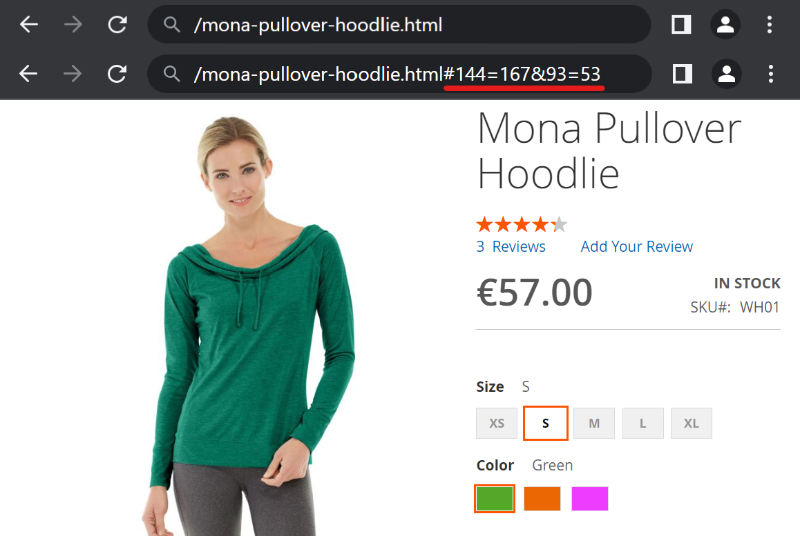
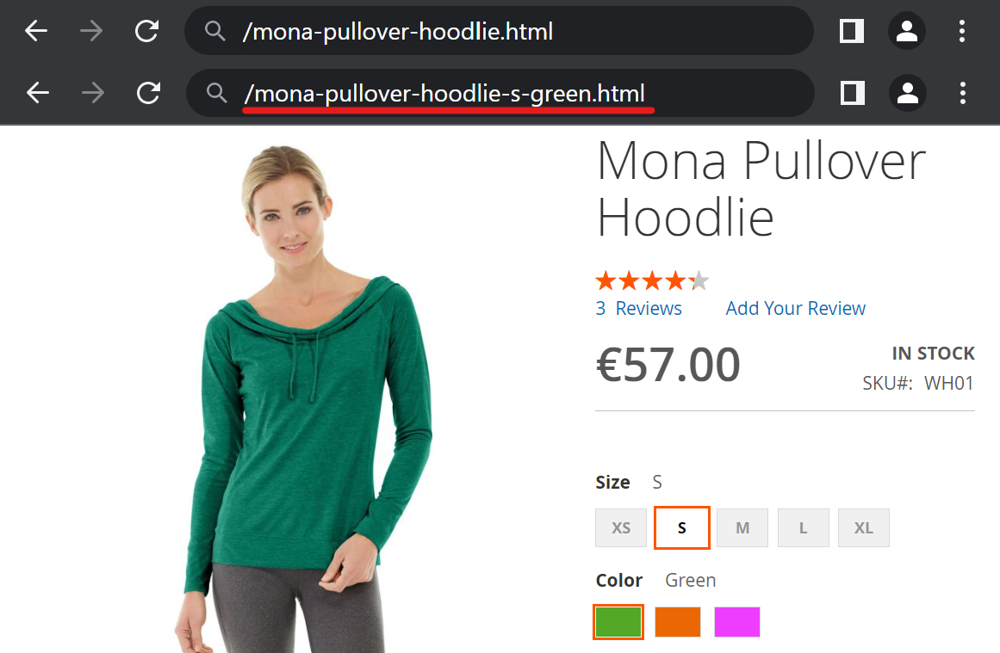

# Simple Product URL

[Leave review](https://commercemarketplace.adobe.com/vct-simpleproducturl.html#bazaarvoice.reviews.tab) to help in further development

[](https://commercemarketplace.adobe.com/vct-simpleproducturl.html)

- [Marketplace Page](https://commercemarketplace.adobe.com/vct-simpleproducturl.html)
- [Release Notes](https://commercemarketplace.adobe.com/vct-simpleproducturl.html#product.info.details.release_notes)
- [Quality Report](https://commercemarketplace.adobe.com/vct-simpleproducturl.html#product.info.details.quality_report)
- [Reviews](https://commercemarketplace.adobe.com/vct-simpleproducturl.html#bazaarvoice.reviews.tab)

## Overview

A [configurable product](https://experienceleague.adobe.com/docs/commerce-operations/operational-playbook/glossary.html?lang=en#configurable-product) appears to be a single product with lists of options for each variant. However, each option represents a separate product.

Redirect a product to a parent configurable product page:

- [x] Increase conversion: customers are more likely to purchase a product if they can see all the available options and compare them side-by-side.
- [x] Simplify decision-making: a configurable product page displays all available options, making it faster and easier to find the right product, minimizing purchase deliberation and decision fatigue.
- [x] Improve SEO: a configurable product page with many possible options will have a higher page ranking than many simple products.
- [x] Reduce customer confusion: eliminating duplicate product pages for simple variants, ensuring a smoother and more focused customer shopping experience.

Pre-select a configurable product options when redirecting from child products:

- [x] Simplify decision-making: streamlines the decision-making process for customers, minimizing decision fatigue.

Show selected variant URL of a configurable product in a browser address bar both when redirecting and when selecting other configurable product options:

- [x] Increase sales: bookmark or share for later purchase selected variant URL of a configurable product.

Show original (canonical) selected variant URL to:

- [x] Reduce customer confusion: preventing customers from seeing products with the similar or unreadable URLs.

### Features

- [x] Support <kbd>Dropdown</kbd>, [<kbd>Visual Swatch</kbd>](https://experienceleague.adobe.com/docs/commerce-admin/catalog/product-attributes/swatches.html?lang=en), [<kbd>Text Swatch</kbd>](https://experienceleague.adobe.com/docs/commerce-admin/catalog/product-attributes/swatches.html?lang=en) attribute input types.
- [x] Support for redirection of [<kbd>Simple</kbd>](https://experienceleague.adobe.com/docs/commerce-operations/operational-playbook/glossary.html?lang=en#simple-product) or [<kbd>Virtual</kbd>](https://experienceleague.adobe.com/docs/commerce-operations/operational-playbook/glossary.html?lang=en#virtual-product) product types.
- [x] No reloads and no AJAX requests when selecting a product.
- [x] Tested and verified by [Adobe Extension Quality Program](https://developer.adobe.com/commerce/marketplace/guides/sellers/extension-quality-program).
- [x] Meets [Magento Coding Standard](https://developer.adobe.com/commerce/php/coding-standards).
- [x] [Plugins (Interceptors)](https://developer.adobe.com/commerce/php/development/components/plugins) are used to prevent conflicts among [modules](https://experienceleague.adobe.com/docs/commerce-operations/operational-playbook/glossary.html?lang=en#module).

## Installation

Use [Composer](https://getcomposer.org/doc/00-intro.md) to install the module or download the code for review:

- [Log in](https://account.magento.com/customer/account/login) to your Marketplace account that purchased this module.
- Add your [<kbd>Access Keys</kbd>](https://commercemarketplace.adobe.com/customer/accessKeys) for [Adobe Commerce Marketplace](https://commercemarketplace.adobe.com) [repository](https://getcomposer.org/doc/05-repositories.md#repository) using the following command:

```bash
composer config http-basic.repo.magento.com <Public Key> <Private Key>
```

where `<Public Key>` and `<Private Key>` are your [<kbd>Access Keys</kbd>](https://commercemarketplace.adobe.com/customer/accessKeys).

For example:

```bash
composer config http-basic.repo.magento.com 39b747b8ab1d624582bb3n1a09deb489 31b9fce4cb78f523fd34aa3abb90c89c
```

- Run the following commands:

```bash
composer require vct/simpleproducturl # Install module with Composer
bin/magento setup:upgrade # Update the database schema and data

bin/magento setup:static-content:deploy --force # Deploy static view files
bin/magento setup:di:compile # Compile the code
```

[Get your authentication keys](https://experienceleague.adobe.com/docs/commerce-operations/installation-guide/prerequisites/authentication-keys.html?lang=en) and [install an extension](https://experienceleague.adobe.com/docs/commerce-operations/installation-guide/tutorials/extensions.html?lang=en) in the Magento documentation.

:::tip[TIP]
Help for common issues is on the [FAQ page](/faq#installation-and-update). For further assistance, please contact me by email [vct.vendor@gmail.com](mailto:vct.vendor@gmail.com?subject=Installation%20issue&body=To%20help%20you%20faster%2C%20please%20provide%20me%20with%20the%20following%20information%3A%0A%0AMagento%20version%20and%20edition%3A%20(e.g.%20Adobe%20Commerce%202.4.6-p6)%0APHP%20version%3A%20(e.g.%20PHP%208.2.8)%0AComposer%20version%3A%20(e.g.%202.2.21)).
:::

## Configuration

:::danger[IMPORTANT]
<kbd>Flush Magento Cache</kbd> in <kbd>SYSTEM</kbd> <kbd>Tools</kbd> <kbd>Cache Management</kbd> after configuration change to see the changes!
:::

[Clean and flush cache types](https://experienceleague.adobe.com/docs/commerce-operations/configuration-guide/cli/manage-cache.html?lang=en#clean-and-flush-cache-types) in the Magento documentation.

### <kbd>Redirect To Parent</kbd>

For example, the product has the URL `/mona-pullover-hoodie-s-green.html`. This product is one of the variants of the configurable product with URL `/mona-pullover-hoodie.html`.

<kbd>Stores</kbd> <kbd>SETTINGS</kbd> <kbd>Configuration</kbd> <kbd>VCT</kbd> <kbd>Simple Product URL</kbd> <kbd>Config</kbd>:

| Config                        | Type                             | Default       | Description                                                                                                                                                                                                                                                                                                                                               |
|-------------------------------|----------------------------------|---------------|-----------------------------------------------------------------------------------------------------------------------------------------------------------------------------------------------------------------------------------------------------------------------------------------------------------------------------------------------------------|
| <kbd>Redirect To Parent</kbd> | <kbd>Yes</kbd><br/><kbd>No</kbd> | <kbd>No</kbd> | <kbd>Yes</kbd> to redirect `/mona-pullover-hoodie-s-green.html` to `/mona-pullover-hoodie.html#143=167&93=53`.<br/><kbd>No</kbd> to not redirect `/mona-pullover-hoodie.html`.<br/><br/>Redirect or not `/mona-pullover-hoodie-s-green.html` to a configurable product page e.g. `/mona-pullover-hoodie.html` with pre-selected options `#143=167&93=53`. |

:::danger[IMPORTANT]
Valid only for [<kbd>Simple</kbd>](https://eVperienceleague.adobe.com/docs/commerce-operations/operational-playbook/glossary.html?lang=en#simple-product) or [<kbd>Virtual</kbd>](https://experienceleague.adobe.com/docs/commerce-operations/operational-playbook/glossary.html?lang=en#virtual-product) products with visibility other than <kbd>Not Visible Individually</kbd> that have available configurable parent product.
:::

For example:



### <kbd>Add Options To URL</kbd>

For example, the product has the URL `/mona-pullover-hoodie-s-green.html`. This product is one of the variants of the configurable product with URL `/mona-pullover-hoodie.html`.

<kbd>Stores</kbd> <kbd>SETTINGS</kbd> <kbd>Configuration</kbd> <kbd>VCT</kbd> <kbd>Simple Product URL</kbd> <kbd>Config</kbd>:

| Config                        | Type                             | Default        | Description                                                                                                                                                                                                                                                                                                     |
|-------------------------------|----------------------------------|----------------|-----------------------------------------------------------------------------------------------------------------------------------------------------------------------------------------------------------------------------------------------------------------------------------------------------------------|
| <kbd>Add Options To URL</kbd> | <kbd>Yes</kbd><br/><kbd>No</kbd> | <kbd>Yes</kbd> | <kbd>Yes</kbd> - `/mona-pullover-hoodie.html#143=167&93=53`.<br/><kbd>No</kbd> - `/mona-pullover-hoodie.html`.<br/><br/>Add or do not add selected variant options e.g. `#143=167&93=53`, to the configurable product URL e.g. `/mona-pullover-hoodie.html`, when selecting a option of a configurable product. |

For example:


### <kbd>Show Selected Variant URL</kbd>

For example, the product has the URL `/mona-pullover-hoodie-s-green.html`. This product is one of the variants of the configurable product with URL `/mona-pullover-hoodie.html`.

<kbd>Stores</kbd> <kbd>SETTINGS</kbd> <kbd>Configuration</kbd> <kbd>VCT</kbd> <kbd>Simple Product URL</kbd> <kbd>Config</kbd>:

| Config                               | Depends on                    | Type                             | Default        | Description                                                                                                                                                                                                                                        |
|--------------------------------------|-------------------------------|----------------------------------|----------------|----------------------------------------------------------------------------------------------------------------------------------------------------------------------------------------------------------------------------------------------------|
| <kbd>Show Selected Variant URL</kbd> | <kbd>Add Options To URL</kbd> | <kbd>Yes</kbd><br/><kbd>No</kbd> | <kbd>Yes</kbd> | <kbd>Yes</kbd> to display selected product URL Key e.g. `/mona-pullover-hoodie-s-green.html`.<br/><kbd>No</kbd> to display parent configurable product URL with a options of pre-selected variant e.g. `/mona-pullover-hoodie.html#143=167&93=53`. |

For example:



:::danger[IMPORTANT]
Valid only for [<kbd>Simple</kbd>](https://experienceleague.adobe.com/docs/commerce-operations/operational-playbook/glossary.html?lang=en#simple-product) or [<kbd>Virtual</kbd>](https://experienceleague.adobe.com/docs/commerce-operations/operational-playbook/glossary.html?lang=en#virtual-product) products with visibility other than <kbd>Not Visible Individually</kbd> that have available configurable parent product.
:::

Enabling <kbd>Show Selected Variant URL</kbd> reduce confusion for customers by preventing them from seeing products with the similar, confusing or unreadable URL.

For example:

- `/mona-pullover-hoodie-s-green.html` instead of `/mona-pullover-hoodie.html#143=167&93=53`,
- `/mona-pullover-hoodie-s-red.html` instead of `/mona-pullover-hoodie.html#143=167&93=54`.

### <kbd>Save Selected Variant URL</kbd>

<kbd>Stores</kbd> <kbd>SETTINGS</kbd> <kbd>Configuration</kbd> <kbd>VCT</kbd> <kbd>Simple Product URL</kbd> <kbd>Config</kbd>:

| Config                               | Type                             | Default       | Description                                                                                                                                                                                                                                                                            |
|--------------------------------------|----------------------------------|---------------|----------------------------------------------------------------------------------------------------------------------------------------------------------------------------------------------------------------------------------------------------------------------------------------|
| <kbd>Save Selected Variant URL</kbd> | <kbd>Yes</kbd><br/><kbd>No</kbd> | <kbd>No</kbd> | Save or do not save URL in the browser history when switching between configurable product variants.<br/>If set to <kbd>Yes</kbd> and the <kbd>Back</kbd> button is pressed in the browser, the previous selected variant will be selected instead of going back to the previous page. |

## Known issue

:::warning[ISSUE]
<kbd>ERR_TOO_MANY_REDIRECTS</kbd> error may appear, when <kbd>Blocks HTML output</kbd> cache is disabled.
:::

:::tip[FIX]
Enable <kbd>Blocks HTML output</kbd> cache in <kbd>SYSTEM</kbd> <kbd>Tools</kbd> <kbd>Cache Management</kbd>.
:::

[Enable or disable cache types](https://experienceleague.adobe.com/docs/commerce-operations/configuration-guide/cli/manage-cache.html?lang=en#enable-or-disable-cache-types) in the Magento documentation.

## Examples

### Configurable product URL with selected options


### Selected product URL


